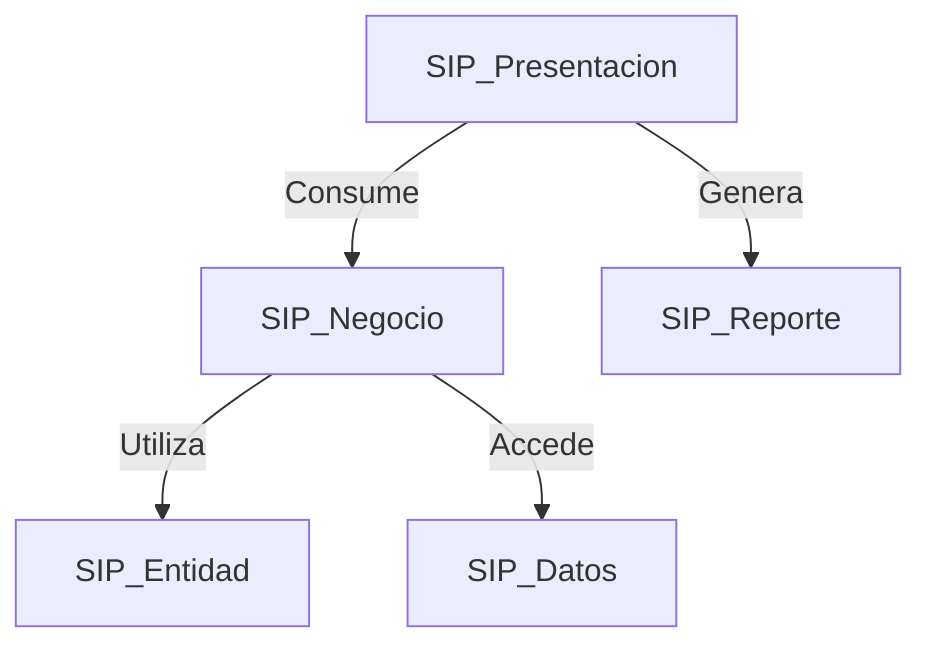
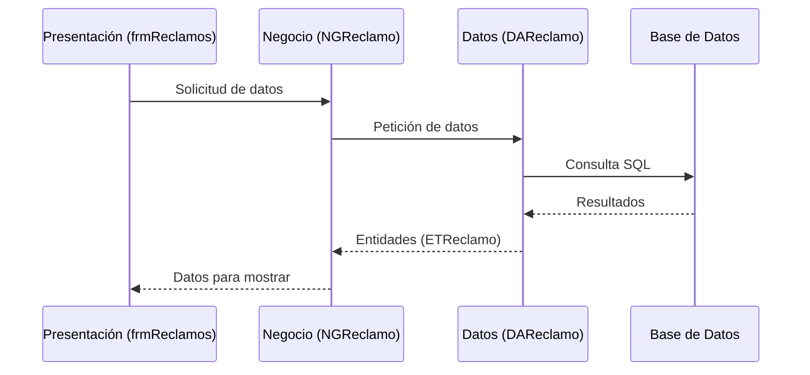

# 🚀 Sistema ERP Empresarial - VB.NET

  
  
  

Un sistema ERP (Enterprise Resource Planning) completo desarrollado en VB.NET con arquitectura en capas, diseñado para gestionar procesos empresariales críticos.

## 🌟 Características Principales

- **Arquitectura en Capas** bien definida para máxima modularidad  
- **Integración con Crystal Reports** para generación avanzada de reportes  
- **Componentes UI profesionales** (DevExpress, Infragistics)  
- **Integración con Microsoft Office** (Excel)  
- **Patrón de diseño MVC** implementado  
- **Módulos separados** por funcionalidad empresarial  

## 🏗 Arquitectura del Proyecto



## 📂 Estructura de Archivos

```
ERP-System/
├── SIP_Presentacion/      # Capa de interfaz de usuario
│   ├── Forms/             # Formularios WinForms
│   │   └── frmReclamos.vb # Ejemplo de formulario
│   └── ...
├── SIP_Negocio/           # Lógica de negocio
│   ├── NGReclamo.vb       # Clase de negocio para reclamos
│   └── ...
├── SIP_Datos/             # Acceso a datos
│   ├── DAReclamo.vb       # Clase de acceso a datos
│   └── ...
├── SIP_Entidad/           # Modelos de entidad
│   ├── ETReclamo.vb       # Entidad de reclamo
│   └── ...
└── SIP_Reporte/           # Generación de reportes
    ├── CrystalReports/    # Reportes de Crystal
    └── ...
```

## 🛠 Tecnologías Utilizadas

- **Lenguaje**: VB.NET
- **IDE**: Visual Studio 2008
- **.NET Framework**: 3.5 SP1
- **Componentes UI**:
  - DevExpress
  - Infragistics
- **Reporting**: Crystal Reports
- **Integración Office**: Microsoft Excel Interop

## 🔧 Requisitos del Sistema

- Windows 7/10/11 o Windows Server equivalente
- .NET Framework 3.5 SP1
- Visual Studio 2008 (para desarrollo)
- Crystal Reports Runtime
- DevExpress Components (versión compatible)
- Microsoft Office (para funcionalidades de Excel)

## 📊 Diagrama de Flujo Básico



## 📌 Convenciones de Código

- **Prefijos para tipos**:
  - `ET` para Entidades (Ej: ETReclamo)
  - `NG` para Negocio (Ej: NGReclamo)
  - `DA` para Datos (Ej: DAReclamo)
  - `frm` para Formularios (Ej: frmReclamos)

## 📄 Licencia

Este proyecto está bajo licencia corporativa. Para más información, contacte al departamento de TI.

---

<div align="center">
  <i>✨ Sistema ERP desarrollado con las mejores prácticas de arquitectura de software ✨</i>
</div>
```
